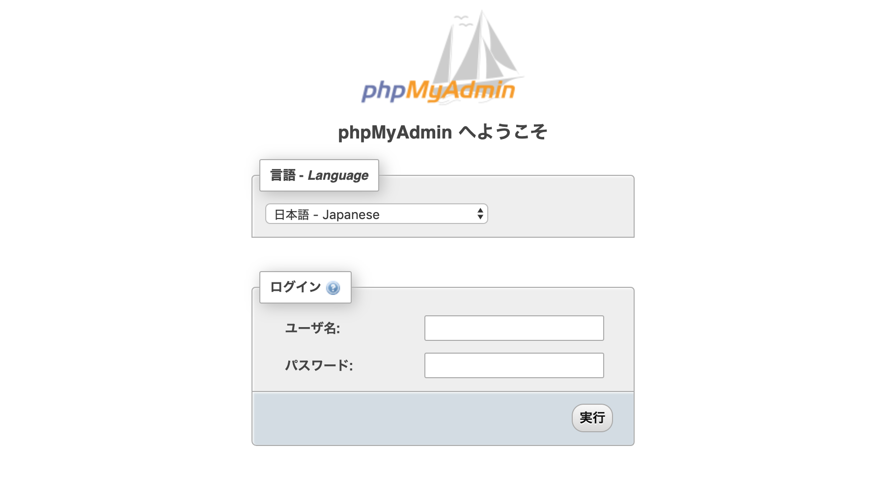

## 概要
``DDmyadmin`` コマンドは 稼働中の MySQL コンテナに接続した状態で phpMyAdmin コンテナを起動します。

## 説明
``DDmyadmin`` コマンドを実行すると peco が起動し稼働中のコンテナ一覧が表示されるので、その中から phpMyAdmin に接続したい MySQL コンテナを選択します。

事前に phpMyAdmin コンテナの準備などは一切必要ありません。phpMyAdmin コンテナイメージが存在しない場合には、自動でダウンロードをしてセットアップします。

``DDmyadmin`` コマンドで phpMyAdmin コンテナが起動したら、ブラウザで ``localhost:8080`` にアクセスすると PhpMyadmin のログイン画面が表示されます。

## Example
``DDmyadmin`` コマンドを実行します。

```bash
$ DDmyadmin
```

peco が起動し、コンテナ一覧が表示されるので、その中から phpMyAdmin に接続したい MySQL コンテナを選択します。

```bash
QUERY>                                                                 IgnoreCase [10 (1/1)]
0333057af059        nutsllc/toybox-nginx:1.15.7-alpine       "/entrypoint-ex.sh"      36 min
a93835fa896d        nutsllc/toybox-nginx:1.15.7-alpine       "/entrypoint-ex.sh"      7 week
0622d9c615ad        nutsllc/toybox-php:7.0-fpm               "/entrypoint-ex.sh p…"   7 week
3963109fdda3        nutsllc/toybox-mariadb:10.1.14           "/entrypoint-ex.sh"      7 week
b67977b1e21e        nutsllc/toybox-nginx:1.15.7-alpine       "/entrypoint-ex.sh"      7 week
e9c9e997f0af        nutsllc/toybox-php:7.0-fpm               "/entrypoint-ex.sh p…"   7 week
bd6f6c506eed        nutsllc/toybox-mariadb:10.1.14           "/entrypoint-ex.sh"      7 week
c0678a620996        jwilder/docker-gen                       "/usr/local/bin/dock…"   7 week
ae953f2b2d71        jrcs/letsencrypt-nginx-proxy-companion   "/bin/bash /app/entr…"   7 week
56f96ed795fc        nutsllc/toybox-nginx:1.15.7-alpine       "/entrypoint-ex.sh"      7 week
```

選択した MySQL コンテナに接続された状態で phpMyAdmin コンテナが起動します。

コンテナが起動したらブラウザで ``localhost:8080`` にアクセスすると phpMyAdmin のログイン画面が表示されます。

